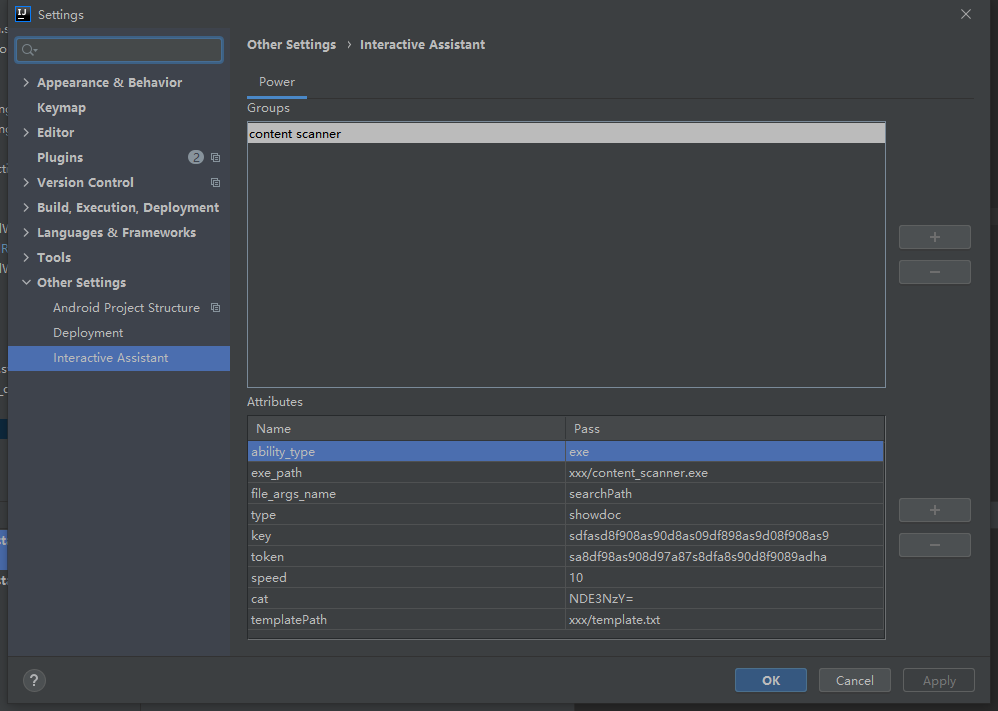

# Content Scanner
### Method Of Use
Write matching comments at the interface layer and execute the program

.js .go .java .php file is currently available for scanning. Please add other types to compile

### Script parameter description

| parameter name | use     | type |
|--------|----------|----------|
|type| the document type, input enum of showdoc/yapi|string
|url| upload the address|string
|key| project api key|string
|token| project api token|string
|speed| number of concurrent upload requests|int
|cat| base 64 encoding of fixed directory, directory using / split|string
|searchPath | the directory or file in which the scan is performed|string
|templatePath| template file path|string
|ask| Ask first, then execute the program|boolean

### The annotation examples
```
/**
 * #doc
 * @class
 * @title
 * @description 
 * @method
 * @query id must int query_id
 * @url /api/update
 * @return {"code":0,"msg":"ok","data":"success","ts":"2020-10-30T03:59:45.591Z"}
 * @return_param id int query_id
 * @remark query request
 */
```

### Explanatory Note
> Comments that begin with /** and end with */ and contain #doc are then parsed by the document

| parameter name | use     |
|--------|----------|
|@class| classify
|@title| name
|@description| describe
|@method| method
|@url| request path
|@header| The First Parameter
|@query| the Query Parameter
|@body| body Parameters
|@return| return Value Example
|@return_param| returned Value Specification
|@remark| remark
|@number| serialNumber

### Document system supported
- ShowDoc
- Yapi

### To support
- Rap

### Hint
@header and @query and @body and @return_param writes the parameters in the order of the corresponding table in the template, separated by Spaces

The JetBrains IDE adds the following to generate templates quickly using a custom Live Template
```
/**
 * #doc
 * @class $class$
 * @title $title$
 * @description $description$
 * @method $method$
 * @url /$path$
 * @return {"code":0,"msg":"ok","data":"success","ts":"2020-10-30T03:59:45.591Z"}
 * @remark $remark$
 */
```

The CAT of the Yapi documentation system is the item classification numeric ID, which is obtained from the classification URL and cannot be uploaded unless it is a number

### Use Through Interactive Assistant on Intellij Platform
0.Download the executable file through Release or compile the executable file yourself
1.Install Interactive Assistant through Settings Plugin
2.Add the configuration through Settings->Other Settings->Interactive Assistant as follows:

3.Then you can use it in the right-click menu -> Abilities
